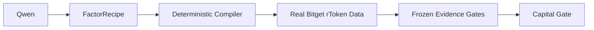

# Factor Discovery Agent

An autonomous Bitget rToken research system where Qwen proposes hypotheses and deterministic evidence decides whether capital is allowed.

Open source under the MIT License.

[Live App](https://factor-discovery-agent.vercel.app) · [Research Proof](https://factor-discovery-agent.vercel.app/proof) · [Research Lab](https://factor-discovery-agent.vercel.app/lab) · [GitHub](https://github.com/Alike001/factor-discovery-agent)

## Why this exists

AI agents are probabilistic, backtests are easy to overfit, and short-history, 24/7 tokenized equities make false confidence especially dangerous. A plausible thesis is not permission to allocate capital.

> The AI is allowed to have bad ideas. It is not allowed to turn bad evidence into a trade.

## How it works



Qwen proposes an economic hypothesis as a constrained recipe. Deterministic code compiles and evaluates it against real Bitget Reality data under precommitted rules. Qwen cannot approve its own evidence or override a failed gate.

## Current research result

| Measure | Result |
| --- | ---: |
| Protocol | `fdp-v3` |
| Global search N | 9 |
| Candidates | 0 |
| Certified | 0 |
| Paper positions | 0 |
| Orders | 0 |
| Fills | 0 |
| Evidence ledger events | 190 |
| Evidence chain | Verified |

Research is closed. Zero trades are the intentional capital-gate outcome: none of the nine committed hypotheses passed the frozen evidence gates, so no factor became eligible for paper probation.

## Two important trials

- [Trial 8 — `beta_residual`](https://factor-discovery-agent.vercel.app/factors/trial-8): `RAMDUSDT` / `RQQQUSDT`. The structured FactorRecipe compiled successfully, but the factor was **rejected** with `FIRST_HARD_FAIL = Stability`. Deflated Sharpe probability was `0.629643` against the `0.90` threshold; permutation `p = 0.2029`; out-of-sample fills were `0`. Lifecycle: `ABANDON`. The structured recipe, not contradictory free-text rationale, defines the executable hypothesis.
- [Trial 9 — `session_transition`](https://factor-discovery-agent.vercel.app/factors/trial-9): Invalid structured output failed Syntax. A repair was projected to exceed the hard Qwen budget and was blocked **before HTTP**. No recipe compiled, and no backtest or evaluation was fabricated.

## Evidence gates

The frozen protocol checks transaction costs (fee and slippage), point-in-time data integrity, next-bar execution, out-of-sample testing, stability, permutation/placebo testing, Deflated Sharpe with global multiple-testing control, and baseline comparison. A compiled factor is only an executable hypothesis; it is not evidence of profitability.

## Product surfaces

| Surface | What it shows |
| --- | --- |
| [Landing](https://factor-discovery-agent.vercel.app/) | The research premise and verified outcome. |
| [Lab](https://factor-discovery-agent.vercel.app/lab) | Research status, trial counts, and frozen gates. |
| [Factors](https://factor-discovery-agent.vercel.app/factors) | Nine committed hypotheses and their outcomes. |
| [Paper](https://factor-discovery-agent.vercel.app/paper) | Locked capital gate and zero paper activity. |
| [Ledger](https://factor-discovery-agent.vercel.app/ledger) | Sanitized, verified event chain. |
| [System](https://factor-discovery-agent.vercel.app/system) | Last-verified provenance, budget, and execution status. |
| [Proof](https://factor-discovery-agent.vercel.app/proof) | The judge-facing evidence path. |
| [Replay](https://factor-discovery-agent.vercel.app/replay?trial=8) | Trial 8 replay from stored artifacts, without model or market calls. |

## Architecture

Qwen `qwen3.8-max` serves bounded proposer and lifecycle roles. A typed `FactorRecipe` is compiled into a safe factor specification and evaluated by deterministic Python research jobs against Bitget Reality/rToken market data. PostgreSQL persists research integrity, budget, and append-only evidence records. The Next.js App Router frontend presents a sanitized, read-only public export; it does not connect to the research database or execute research during page rendering. The repository contains a Python research backend, not a deployed FastAPI service.

The official `@bitget-ai/bitget-agent-sdk` is integrated in a server-side readiness layer. Its read-only market tool was verified against `RAMDUSDT`; that connectivity check is separate from the frozen historical research dataset. A deterministic Candidate-to-`OrderIntent` contract rechecks evidence, freshness, symbol, size, capital, and risk before a bounded paper dry-run can be considered. The public execution mode remains `READ_ONLY`: with no qualified Candidate, the bridge returns `BLOCKED_NO_CANDIDATE`, produces no order intent, and invokes no SDK write tool. No real-money order was placed.

## Bounded autonomy

- Under `fdp-v3`, Qwen submits a FactorRecipe, not a raw executable AST or arbitrary Python.
- Hard token reservations are admitted before each Qwen HTTP call; repairs have their own reservation and a one-repair limit.
- Failed proposals stay visible. There are no hidden replacement trials or automatic revision children.
- The append-only evidence chain records commitments and decisions; cumulative search N does not reset when the protocol version changes.

## Running locally

Python 3.12 is required for the research backend. From the repository root:

```bash
python3.12 -m venv .venv
. .venv/bin/activate
pip install -e '.[dev]'
python scripts/preflight.py
pytest
```

The preflight checks public data and records blocked or unverified credential-dependent capabilities without inventing results. Keep any local credentials in a Git-ignored `.env`; no credentials are needed to view the public snapshot.

For the frontend and Node 24 integration tests:

```bash
cd web
npm ci
npm run lint
npm run test:integration
npx tsc --noEmit
npm run build
npm run dev
```

To repeat the credential-free, read-only SDK market probe, run `npm run probe:bitget-agent` from `web/`. It refreshes only the separate SDK-readiness artifact; it does not run research or place an order.

## Public deployment

The Vercel Root Directory is `web/`. The judge-facing app runs in read-only, evidence-backed snapshot mode from committed sanitized JSON. The separate [Bitget Agent SDK readiness artifact](web/public/evidence/BITGET_AGENT_SDK_STATUS.json) records a public market check without altering the historical evidence manifest. The deployed pages do not invoke the SDK, expose a research, paper, or trading trigger, or need production Qwen, Bitget, Demo, or database secrets. See [public deployment guidance](docs/PUBLIC_DEPLOYMENT.md).

## Current limitations

- The authenticated account fee remains unverified; research uses an explicitly assumed published fee baseline plus frozen slippage.
- Bitget Demo execution is unverified, and no factor qualified for forward paper probation.
- The public app is an exported evidence snapshot, not a live managed research database.
- Unsupported research families remain intentionally hidden rather than offered as executable capabilities.

## Hackathon

Built for Bitget AI Genesis S2. Track: **Agentic Trading**. Direction: **Factor Discovery / rToken research**.

## License

This project is open source under the [MIT License](LICENSE).
